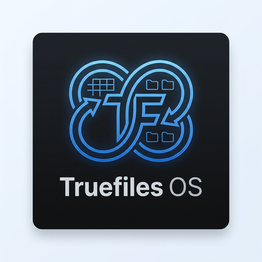

# Truefiles OS

<p align="center">
  
</p>

**Truefiles OS** es un gestor de archivos para Linux enfocado en backups y organización, que reúne en una sola app de escritorio todo lo que normalmente requiere terminal o múltiples herramientas sueltas.

Sincronización rsync con panel dual (local ↔ local o local ↔ SSH), etiquetado semántico de archivos vía xattr, detección de duplicados por hash, visor de archivos integrado, programador de backups con cron visual, snapshots del sistema con Timeshift, historial de sincronizaciones y gestión de perfiles SSH.

---

## Features

### Sync
Dual-panel file browser (local ↔ local or local ↔ SSH). Choose your rsync mode visually:

| Mode | Behavior |
|---|---|
| **Mirror** | Exact copy — deletes files not in source (`--delete`) |
| **Sync** | Copies new and updated files only (`--update`) |
| **Incremental** | Versioned backup with date-stamped copies (`--backup`) |
| **Dry Run** | Preview what would change without touching anything |

Extras: real-time output terminal, bandwidth limiter (KB/s), excludes editor with presets (`.git/`, `node_modules/`, etc.), desktop notification on finish.

### SSH / VPS
Save connection profiles (host, user, port, key path). Browse remote directories directly in the file panel, run rsync over SSH — no manual flag building.

### Schedule
Visual cron scheduler. Pick daily, weekly, or custom intervals. Jobs survive reboots, stored in your system crontab with labeled markers.

### Tags
Semantic file tagging using Linux extended attributes (`xattr`). Tags are invisible in the filename, travel with files during rsync (`--xattrs`), and work on any local filesystem. Autocomplete from existing tags. Filter files by tag. SSH mode for browsing.

### Duplicates
Two-phase detection: group by file size (no I/O), then FNV-1a hash to confirm. Shows recoverable space per group. Per-file checkbox to choose what to keep. Sends copies to system trash (`gio trash`) — recoverable, not permanent delete.

### File Viewer
Inline preview panel for: **images** (JPG, PNG, GIF, BMP, WebP, SVG, AVIF), **PDF** (native Chromium renderer), **Markdown** (parsed and rendered), and **plain text**. Opens as a side panel without leaving context.

### Timeshift
Create, list, and delete system snapshots via `pkexec timeshift` — shows the native auth dialog, no terminal needed.

### History
Log of every sync run: source, destination, mode, duration, success/fail. Searchable, clearable.

---

## Stack

| Layer | Technology |
|---|---|
| Desktop runtime | [Tauri v2](https://tauri.app) |
| Backend | Rust (file I/O, xattr, rsync subprocess, cron, SSH) |
| Frontend | React 18 + TypeScript + Vite |
| Styling | Tailwind CSS v4 |
| Icons | Lucide React |
| Markdown | marked |
| Base64 encoding | base64 (Rust crate) |

---

## Requirements

- Linux (x86_64)
- `rsync` installed
- `ssh` / `openssh-client` for remote features
- `python3` on the remote server (for SSH directory listing)
- `timeshift` installed (optional, for snapshot module)
- `gio` for trash support (standard on GNOME/GTK desktops)

---

## Install

Download the AppImage from [Releases](https://github.com/Scrambledeggs-ai/truefiles-os/releases):

```bash
chmod +x "Truefiles OS_0.1.0_amd64.AppImage"
./"Truefiles OS_0.1.0_amd64.AppImage"
```

No installation required. Runs from any folder.

---

## Build from source

**Prerequisites:** Node.js 18+, Rust (via rustup), system dependencies for Tauri on Linux.

```bash
# Install Tauri system dependencies (Ubuntu/Debian)
sudo apt install libwebkit2gtk-4.1-dev libgtk-3-dev libayatana-appindicator3-dev librsvg2-dev

# Clone and install
git clone https://github.com/Scrambledeggs-ai/truefiles-os.git
cd truefiles-os
npm install

# Development (hot reload)
npm run tauri dev

# Production AppImage
npm run tauri build
# Output: src-tauri/target/release/bundle/appimage/
```

---

## Architecture

```
truefiles-os/
├── src/                    # React frontend
│   ├── components/         # FileBrowser, FileViewer, TagChip, Sidebar…
│   ├── pages/              # One component per module (Sync, Tags, Duplicates…)
│   └── lib/                # Types, utils, color helpers
└── src-tauri/
    ├── src/lib.rs          # All Rust commands (~1000 lines)
    └── tauri.conf.json     # Window config, app identity
```

The Rust backend exposes ~30 Tauri commands covering: directory listing (local + SSH), rsync subprocess with streamed output, cron management, xattr tag read/write, duplicate detection, Timeshift integration, and file reading for the viewer.

---

## License

MIT
